# Orise Twin Rotor User Guide


# Getting Started

# Turning on the Twin Rotor
After making sure the system is plugged in, press the power button on the system and the power button will cycle through some colors indicating that the system is booting up. This will take approximately 70 seconds. After it finishes booting up the color will become **yellow** and it will stay at that color indicating that the system is ready for operation. This is the stand-by mode.
## Connecting to the Twin Rotor
The main way you can connect to the twin rotor is via connecting to it via [SSH](https://en.wikipedia.org/wiki/Secure_Shell).
### Connecting the Twin Rotor to the Network

### User Credentials
| | |
|---|---|
|Hostname|OriseTRS|
|Username|pi|
|default password|raspberry|
### Connecting Via SSH
Once you have connected the Twin Rotor to the network, connect your device to the same network so you can SSH into the system. 
You can use any ssh client to connect to the system (ssh that comes with your system or PuTTY) however **we strongly recommend** using [**MobaXterm**](https://mobaxterm.mobatek.net/documentation.html) the rest of this guide will assume you are using MobaXterm.

1. First install MobaXterm at [https://mobaxterm.mobatek.net/download.html](https://mobaxterm.mobatek.net/download.html) if you haven't already. The free version is more than adequate for any use case with the Twin Rotor System.

2. Now we need to create a session so we can easily connect to the system without having to type in a lot of credentials the following steps indicate how to do that. **You only need to do these steps (steps 3-6) once**
3. Open up MobaXterm and click the Session Tab.

    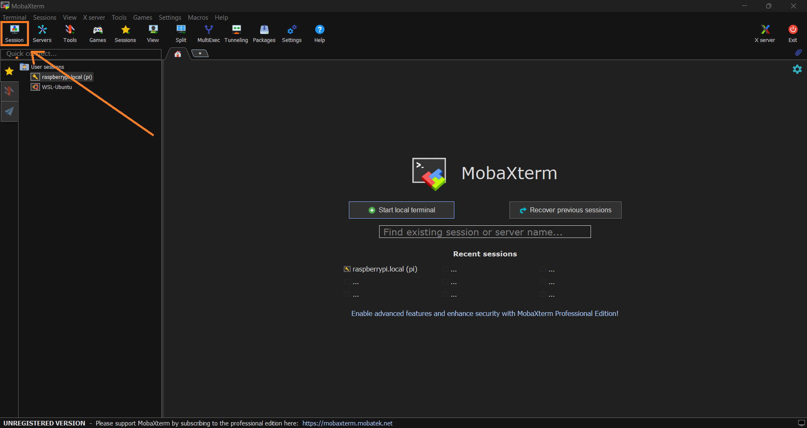

5. Now in the newly opened window click on the SSH icon. This will open another window. Enter the hostname as **OriseTRS.local** and check the box containing specifyy username and enter the user name as **pi**. Click on **Advanced SSH settings** and choose **SCP enhanced speed**. Then, click OK. You will get a pop up after this click Accept. (after this you might sometimes get a window saying choose session type in that case choose SSH and click OK.)

    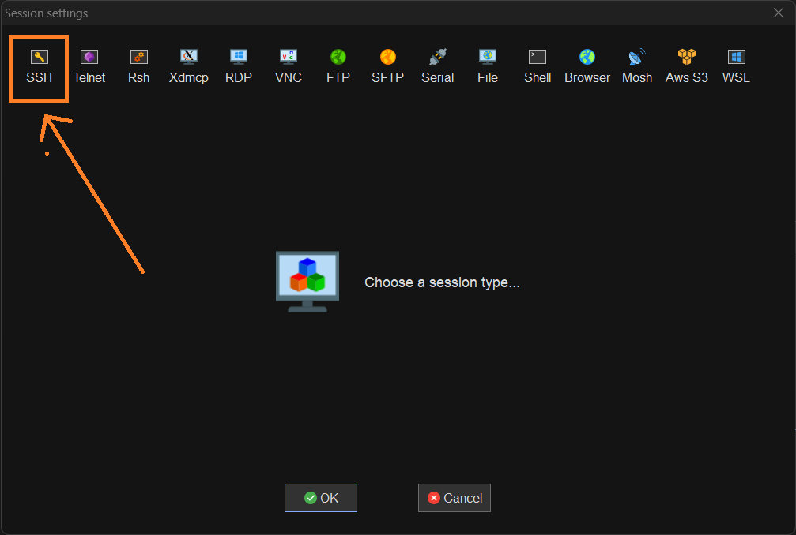
    
    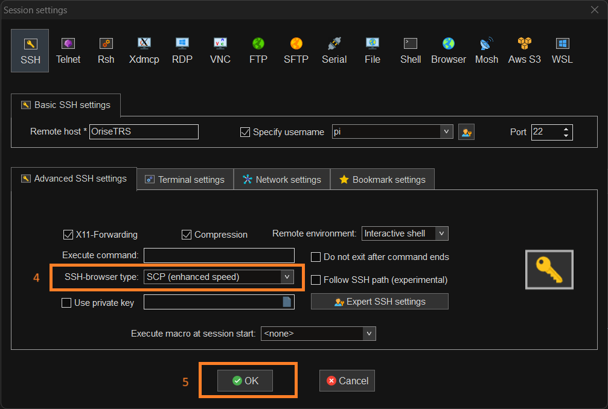
    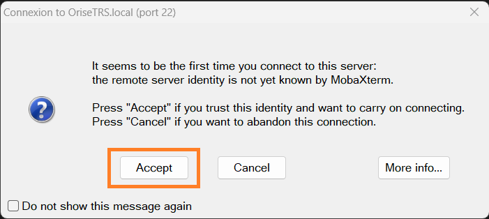

6. Once you do the above steps the session information will be saved and you can now connect to the system easily from now on. If you were already connected to the network and the system is connected and ready when you were saving the session, you will be taken directly be taken to the password prompt (see step 8). Otherwise you will get a pop saying the host is not found. This is okay and the session will still be saved, just click OK. Make sure the system is correctly setup before step 7.

7. Now you should see OriseTRS.local (pi) in the user sessions tab in the left (this may be the only entry in your setup). Click on the session to SSH into the system.

    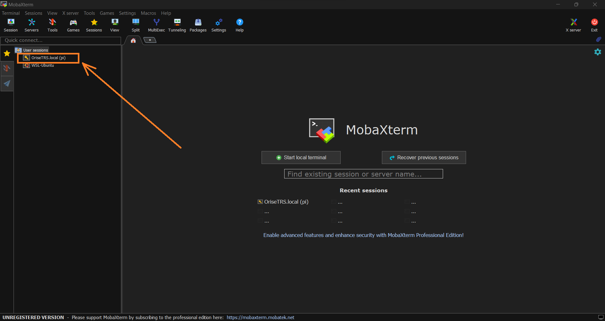

8. This will open a tab and a password prompt to enter the password prompt. The password is **raspberry** (All in lowe case) enter the password and press enter.(The password wont be shown as you type it make sure you type it correctly and CAP-LOCK is off. If you miss type the password, the system will say Access denied and ask you for the password again.)

    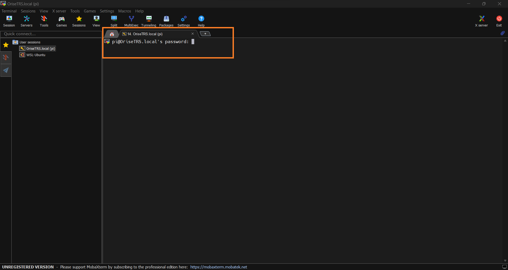

9. Once you enter the password you will be get a pop asking to save the password using a master password click NO for now however if you like to explore this option check out the MobaXterm documentation. Once you do this you will be greeted with a terminal. (It may take a few seconds)


    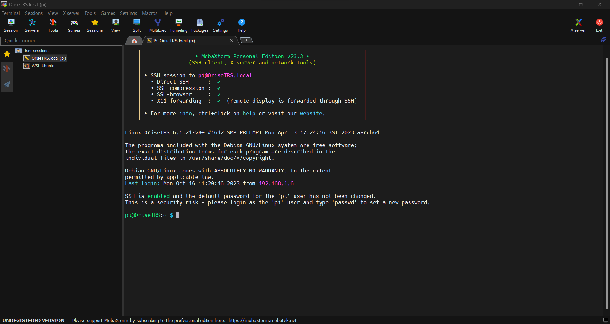

**Now you are logged into the system via SSH**

## Running Examples
1. Navigate to the Twin_Motor_Demo and list the files.

2. Run your chosen example, with python3,
```bash
python3 data_plotter_example.py
```
3. You will get a gui window plotting the encoder and pitch data. 


    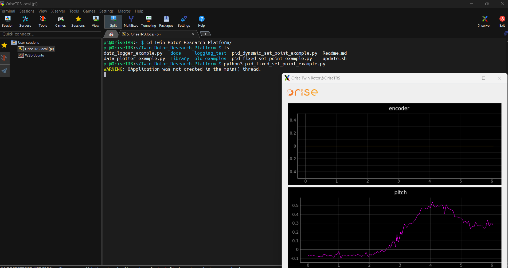

4. Close the resulting GUI window to close the program.

## Shutting Down 
It is **strongly recommended** that you shutdown the raspberry pi before you press the power off button. You can do it with the following command
```bash
sudo shutdown -h now
```
# Transferring Files
Connect to the pi using ssh and Click on the file browser tab.
    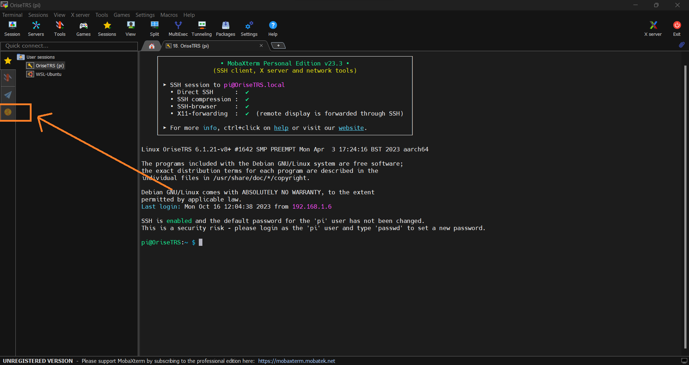
    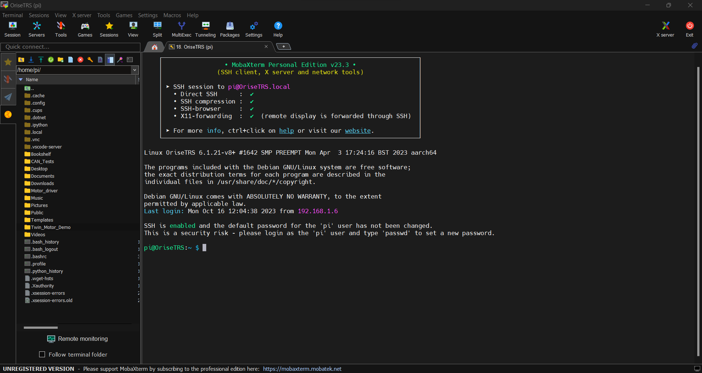

You can exlpore the file system using this tab. You can also upload and download files by draggin and dropping. (You can also use download and upload buttons)

# Editing Files and Coding on the System

There are several ways to edit files on the system
1. Terminal Text Editor like nvim (nvim, vim and nano are installed on the system.)
2. Using MobaXterm.
    You can edit a file by navigating to the file and right clicking on it if you can select on several options if you select open with you can open it in your default text editor and after making the necessary changes MobaExterm will ask whether to update the changes click YES to that.

3. Using VsCode. (Recommended)
    1. Open VsCode
    2. Install the Remote-SSH extension

        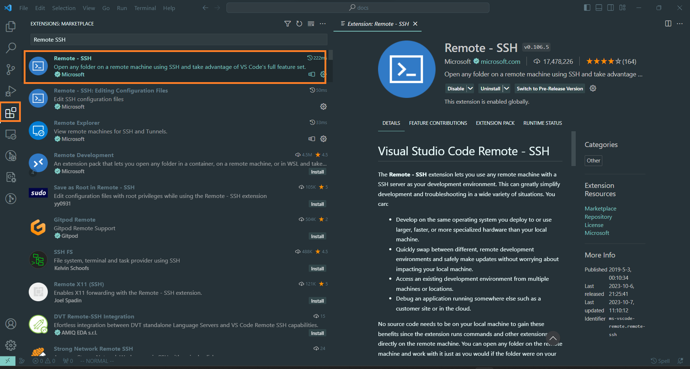
    3. Click on the Open Remote Window Option and select Connect to Host

        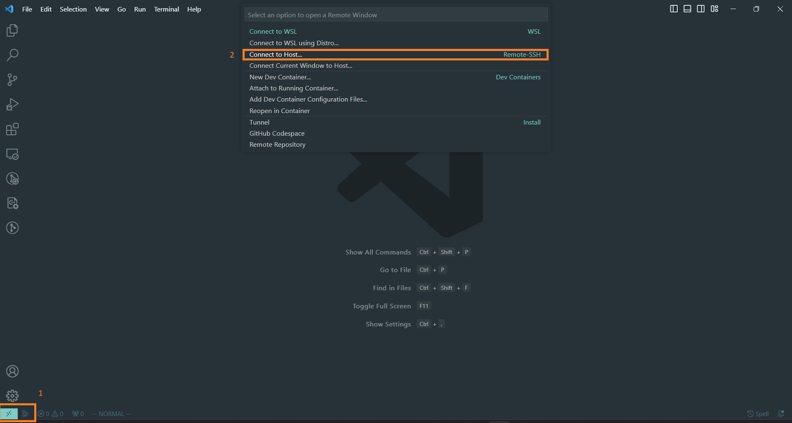
    4. Type in the hostname as pi@OriseTRS.local 

        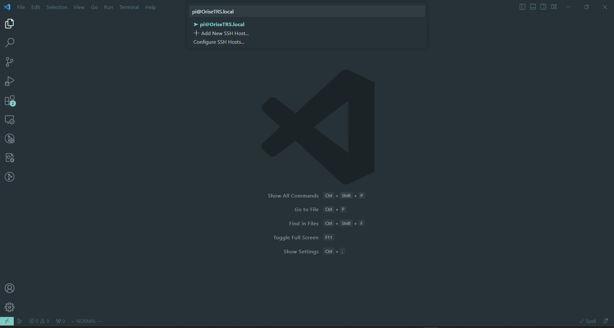
    5. This will open a new window. It will ask the platform type choose Linux. In the next part click Coninue. Finally enter the password when prompted. 

    6. Select Open Folder and select the folder of your choosing.

        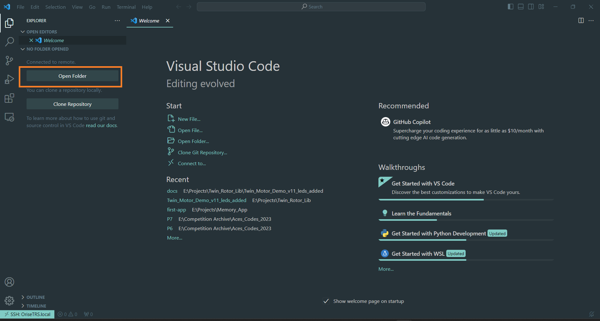
        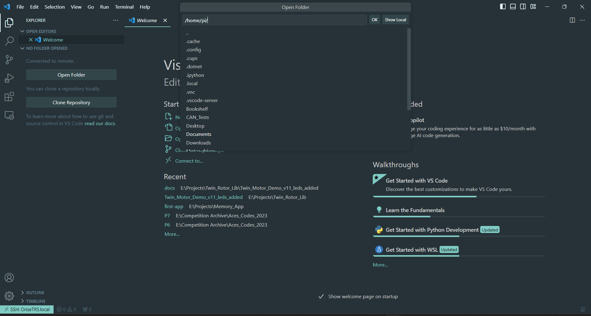

# Using the Data Plotter
The data plotter is a convenient library provided to quickly plot sensor data and other variables quickly while experimenting with the twin rotor.

## Basic Usage - Plotting Raw Sensor Data

Let's consider the following code for instantiating the gui as an example.

```python
from Orise_Twin_Rotor import Data_Buffers
from Orise_Twin_Rotor import Twin_Rotor
from Orise_Twin_Rotor import Create_Gui,READING_NAMES
import numpy as np

def main():
    twin_rotor = Twin_Rotor()

    #creating data buffers
    data_buffers = Data_Buffers(1000)


    #creating the gui
    gui_application = Create_Gui(data_buffers)

    #########################adding the plots###########################
    gui_application.add_twin_rotor_data("encoder",READING_NAMES.ENCODER1,(255,0,0))
    gui_application.add_twin_rotor_data("mag",READING_NAMES.MAG_X,(255,0,0),"mag_x")
    gui_application.add_twin_rotor_data("mag",READING_NAMES.MAG_Y,(0,255,0),"mag_y")
    gui_application.add_twin_rotor_data("mag",READING_NAMES.MAG_Z,(0,0,255),"mag_z")
    ####################################################################

    #starting the application
    gui_application.start()
    
    while True:

        twin_rotor.update_readings()
        data_buffers.update_buffers(twin_rotor)
        if(not gui_application.active):
            break


if __name__ == "__main__":
    main()
```

Considering the above program three things need to be done to successfully create the plots 

- Importing the Libraries
- Creating the GUI
- Adding the Plots
- Starting the GUI

In addition to the above three the data_buffers need to be updated as well with the incoming data.

## Importing the Libraries
```python
from Orise_Twin_Rotor import Create_Gui 
```
The first line imports the main Plotting Library that creates the gui called Create_Gui
```python
from Orise_Twin_Rotor import Data_Buffers 
```
this line imports the data_buffers which is needed to store the incoming samples this will be where the gui gets the data to be plotted

```python
from Orise_Twin_Rotor import Twin_Rotor 
```
this is used to get sensor data from the instrument and controlling the instrument this is not related to the gui, the data obtained from the twin rotor will be imported to the

## Creating the GUI
Make sure you have imported the necessary libraries


The first thing to do is to create the GUI this is done with the line,
```python
gui_application = Create_Gui(data_buffers)
```
You can call it whatever you want. You need to pass in a data_buffers object, this object needs to be created **before** the instantiation of the gui with the line

```python
data_buffers = Data_Buffers(1000)
```
when creating the data_buffer object you must pass in a size (in the above example it is 1000). This is the length of samples that will be displayed when plotting the graphs. In other words in the above example when plot the graphs the last 1000 samples will be displayed in the plot. (The buffer is there to store the last 1000 samples and is implemented as a queue.)

Once this is done you can move on to adding the plots that you need

## Adding the plots
There are three ways to plot the data, in this example one way will be illustrated (that is the way to plot the raw sensor data). The other two ways will be explained subsequently

```python
gui_application.add_twin_rotor_data("encoder",READING_NAMES.ENCODER1,(255,0,0))
gui_application.add_twin_rotor_data("mag",READING_NAMES.MAG_X,(255,0,0),"mag_x")
gui_application.add_twin_rotor_data("mag",READING_NAMES.MAG_Y,(0,255,0),"mag_y")
gui_application.add_twin_rotor_data("mag",READING_NAMES.MAG_Z,(0,0,255),"mag_z")
```

To plot raw sensor data you can use the method add_twin_rotor_data which has the following signature, if the 

```python
gui_application.add_twin_rotor_data(title:str,
                                    reading_name:str,
                                    color:Tuple[int,int,int]
                                    name:str)
```
The first two parameters are required and the last two are optional.

### title
The first parameter title is a string which is name of the plot that the graph is added to, if a plot by that name does not already exist it will be created, otherwise the graph will be added to the existing plot.

So for example in the above graph two plots will be created one names **encoder** and one named **mag** the encoder plot will display **one graph** and the plot named mag will show **three graphs**

### reading_name
reading_name. this is the name of the reading that you wish to plot you can provide this as a string like 'encoder1' instead of READING_NAMES.ENCODER1 but you need to make sure the name matches exactly and spelling is correct and such. It is much easier to import READING_NAMES and choose the reading that you desire. You can provide one of the following options

- READING_NAMES.ENCODER1 
- READING_NAMES.ACC_X  
- READING_NAMES.ACC_Y 
- READING_NAMES.ACC_Z 
- READING_NAMES.GYRO_X 
- READING_NAMES.GYRO_Y 
- READING_NAMES.GYRO_Z 
- READING_NAMES.MAG_X 
- READING_NAMES.MAG_Y 
- READING_NAMES.MAG_Z 

you could also pass one of ("encoder1","acc_x","acc_y","acc_z","gyro_x","gyro_y","gyro_z","mag_x","mag_y","mag_z") instead like,


```python
gui_application.add_twin_rotor_data("encoder","encoder1",(255,0,0))
```

### color (Optional)
This is an optional parameter you can pass giving the color of the graph that is plotted. The color must be ginve as a three tuple of integers in (r,g,b) format the number must be a value between 0-255. If a color is not passed the graph will be plotted in the default color

### name (Optional)
This is another optional parameters that gives a name to the plot. This is useful when plotting many graphs in the same plot, since this will automatically create a legend to the plots that you a gave name to in the above graph the enocoder plot will have no legend and the mag plot will have legend indicating the names of the three plots.

## Running the GUI.
Once you start the GUI you can run it using

```python
gui_application.start()
```
> [!IMPORTANT]
>
> Make sure this command is executed **after** you have added the plots. Any plots that is added afterwards will not be rendered.

## Updating buffers and While Loop
Everything necessary to setup the gui is done then we have the main program loop. 

```python
    while True:

        twin_rotor.update_readings()
        data_buffers.update_buffers(twin_rotor)
        if(not gui_application.active):
            break
```
twin_rotor.update_readings() is responsible for updating the readings from the Twin_Rotor.(See the Twin_Rotor section for further details.)

data_buffers.update_buffers(twin_rotor) is responsible for updating the buffers with the new readings, if you don't do this **you won't see any change in the plots**


```python
    if(not gui_application.active):
        break
```
This is used to terminate the program once you close the gui. gui_application.active checks whether the user has close the plotting gui and if so it will be false. If you exclude this part the program will keep running even after you close the program.

# Plotting Custom Data.
The above example showcases the most basic form of plotting that is plotting the raw sensor data from the device, however often you may need plot a calculated value or some variable in the code or some modified form of the raw data. In order to facilitate this two more methods are provided for plotting in the Create_Gui class


```python
    add_custom_buffer_graph(self,title:str,buffer:Custom_Buffer,color:Tuple[int,int,int],name:str):
    add_time_graph(self,title:str,buffer_data_func:Buffer_Data_Func,color:Tuple[int,int,int],name:str):
```

Most of the parameters are identical to the methods discussed before and behave in exactly the same way (as before the last two parameters are optional). The only difference is in the second parameter which specifies what data to be plotted. This will be discussed for the two methods seperately.

### Plotting Custom Data using Custom Buffers **add_custom_buffer_graph**
This can be used to plot a time varying parameter that you calculate(pitch,roll,yaw using IMU fusion, pid control value etc.) or some parameter you set (set point that the pid is supposed to follow etc.) consider the following code example. **Only a portion of the code is shown** for sake of clarity and parts that are not relevant to the discussion are removed (indicated by Some code)
```python
######
##Some code
#######
def main():
    ######
    ##Some code
    #######
    data_buffers = Data_Buffers(1000)

    #<---------IMPORTANT---------->
    custom_buffer = data_buffers.get_custom_buffer() 


    gui_application = Create_Gui(data_buffers)
    gui_application.add_twin_rotor_data("encoder",READING_NAMES.ENCODER1,(255,0,0))
    gui_application.add_twin_rotor_data("mag",READING_NAMES.MAG_X,(255,0,0),"mag_x")
    gui_application.add_twin_rotor_data("mag",READING_NAMES.MAG_Y,(0,255,0),"mag_y")
    gui_application.add_twin_rotor_data("mag",READING_NAMES.MAG_Z,(0,0,255),"mag_z")


    #<---------IMPORTANT---------->
    gui_application.add_custom_buffer_graph("pitch",custom_buffer,(0,255,0),"set_point")


    gui_application.start()


    while True:
        ####
        ##Some Code -- the code that calls Twin_Rotor.update_readings() happens here and is not shown
        ###
        data_buffers.update_buffers(controller.twin_rotor)
        


        #<---------IMPORTANT---------->
        point = dynamic_set_point_square(time()-t) #don't worry what this is calculating the only important things is that is a variable that is calculated every iteration that varies with time
        

        #<---------IMPORTANT---------->
        custom_buffer.push(point)
        
        ######
        ##Some code
        #######

        if(not gui_application.active):
            break
if __name__ == "__main__":
    main()
```
The things that are needed for the gui are done as before. 

The important parts that are relevant to this discussion are marked with #<---------IMPORTANT---------->

In order to plot you own variable (the variable must be a float) you need a data_buffer to store the history of the variable. You cannot use the Data_Buffers for this since it is used to store the raw values. You can get you own data_buffer by calling the **get_custom_buffer()** method on the Data_Buffers object you create (data_bufferes in the above example), this will give you a custom_buffer to which you can push your values to to be plotted. In the above example this is,

```python
    custom_buffer = data_buffers.get_custom_buffer() 
```

> [!Note]
>
> You need to create a custom buffer for each of the variabels that you wish to plot for example if you want to plot custom three variables you need three custom_buffers

```python
    custom_buffer_for_variable1 = data_buffers.get_custom_buffer() 
    custom_buffer_for_variable2 = data_buffers.get_custom_buffer() 
    custom_buffer_for_variable3 = data_buffers.get_custom_buffer() 
```


Once you create the custom buffer you can add it to be plotted in the gui this can be done by, the method **add_custom_buffer_graph**

This works exactly as the **add_twin_rotor_data** function except instead of providing the name of the reading to be plotted you give the custom buffer. In the above example this is done by,


```python
    gui_application.add_custom_buffer_graph("pitch",custom_buffer,(0,255,0),"set_point")
```
This adds the custom_buffer to a plot called "pitch" with the name "set_point"

Finally you must push the value to you custom buffer as it is calculated (this is equivalent to data_buffers.update_buffers())
        
```python
    custom_buffer.push(point)
```
If you have more than one value (in which case you must have an equal number of buffers) you can push them to their relevant buffers.

```python
    custom_buffer_for_variable1.push(variable1) 
    custom_buffer_for_variable2.push(variable2)
    custom_buffer_for_variable3.push(variable3)
```

For 99% use cases the above two functions will suffice there is one more way to plot functions but that is a bit more trickier so use it only if you have a real need for it.


### Plotting by providing a function to calculate data from raw readings.
This is a older function to plot data that is convenient in some cases but require some familiarity with python to use effectively, consider the following example

```python
from Orise_Twin_Rotor import Data_Buffers
from Orise_Twin_Rotor import Twin_Rotor
from Orise_Twin_Rotor import Create_Gui
import numpy as np

def main():
    twin_rotor = Twin_Rotor()

    data_buffers = Data_Buffers(1000)
    gui_application = Create_Gui(data_buffers)
    gui_application.add_time_graph("encoder",lambda x: x.encoder1.data)

    #<---------IMPORTANT---------->
    gui_application.add_time_graph("pitch",lambda x: np.arctan2(x.acc_x.numpy_data,x.acc_z.numpy_data))

    gui_application.start()
    
    while True:
        twin_rotor.update_readings()
        data_buffers.update_buffers(twin_rotor)

        if(not gui_application.active):
            break

if __name__ == "__main__":
    main()
```

Pay attention to the line marked important that uses the add_time_graph function the first and the last two parameters are similar to before.

To use the plotting mechanism you need to provide a function to the second parameter (in the above example it is a lambda function but you can use any function for this as well.) the function must have the following format

```python
def function_name(data_buffers)->Iterable[float]:
    '''
    write your code here
    '''
    return Iterable_of_floats
```


The function must take exactly one argument and that argument is data_buffers (this will provided to the function when the function is called when plotting by the Create_Gui object) and it must return and iterable of floats (a numpy_array or tuple or list,  numpy array is the easiest option) and the size or length of the returned iterable must be of the same length as the data_buffers

You can access different raw_sensor data buffers as numpy arrays by using the following syntax

```python
self.time.numpy_data
self.encoder1. numpy_data
self.acc_x.numpy_data
self.acc_y.numpy_data
self.acc_z.numpy_data
self.gyro_x.numpy_data
self.gyro_y.numpy_data
self.gyro_z.numpy_data
self.mag_x.numpy_data
self.mag_y.numpy_data
self.mag_z.numpy_data
```
**however instead of self use the parameter name you defined** for example

```python
def difference_between_x_and_y_accelerations(data_buffers)->Iterable[float]:
    acceleration_x_array = data_buffers.acc_x.numpy_data

    acceleration_y_array = data_buffers.acc_y.numpy_data
    return acceleration_x_array - acceleration_y_array
```

or 

```python
def calculate_angle(buffer)->Iterable[float]:
    acceleration_x_array = buffer.acc_x.numpy_data

    acceleration_z_array = buffer.acc_z.numpy_data
    return np.atan2(acceleration_z_array,acceleration_x_array)
```
This is also what is done in the lambda function in the example above

```python
gui_application.add_time_graph("pitch",lambda x: np.arctan2(x.acc_x.numpy_data,x.acc_z.numpy_data))
```
> [!IMPORTANT]
>
>You can also use other variables defined in your program in the function as well. This can be done by capturing them in the function closure or by using a callable class (a class with __call__ defined in it) however when ever you do this you need to make sure this data is thread safe, if you are unsure of what that means it is recommended to use custom data buffers instead.


## Checking if the Gui is Active
you can check whether the user has closed the gui or not by using the .active property on the gui. If it is True then the gui is still active if it is False then the gui was closed by the user.

## Things to watch out for.
If you are terminating the program using a keyboard interrupt (Ctrl+C) make sure you close the gui before hand otherwise the program may crash


## Trouble Shooting
### The Gui is not starting up
- Make sure you are calling **.start()**
- Make sure you are ssh-ing into the raspberrypi using a program that supports X11 forwarding of guis such as MobaXterm 

### The Gui starts up but no plots (or just some plots) are plotted
- Make sure you are adding the plots **before** calling **.start()**

### The plots show up but the graphs don't show or anything (or they are static)
- Make sure you are updating your buffers,sensor readings that is make sure you correclty calling the functions, 
    - .update_buffers on Data_Buffers object
    - .push on Custom_Buffers
    - .update_readings on your twin rotor object (otherwise the readings stay the same see Twin_Rotor Section)


